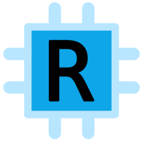

    

<h1 align="center">
    Rugpi
</h1>
<h4 align="center">
    An open-source platform empowering you to build innovative products based on Raspberry Pi.
</h4>

💡 **TL;DR**: Rugpi enables you to **build commercial-grade, customized variants of [Raspberry Pi OS](https://www.raspberrypi.com/software/)** for your project.
It boasts three core features: (1) A modern workflow to build customized system images, (2) robust **over-the-air updates with rollback support** of the entire system, including firmware files, and (3) **managed state** which is preserved across reboots and updates.

Checkout the [documentation](https://oss.silitics.com/rugpi/) for details.

### Supported Boards

In principle, Rugpi supports all Raspberry Pi models.
For further details, [read the docs](https://oss.silitics.com/rugpi/docs/guide/supported-boards).

### Stability Guarantees

While Rugpi is a young and evolving project, we understand that the lifetime of embedded devices spans multiple years, if not decades. Backwards incompatible changes to the update mechanism will be made only after careful consideration and consultation with our users. This ensures that devices using Rugpi can be updated in the future. If you're developing integrations with Rugpi, please be aware that the CLI and APIs are still expected to change.

## ⚖️ Licensing

This project is licensed under either [MIT](https://github.com/silitics/rugpi/blob/main/LICENSE-MIT) or [Apache 2.0](https://github.com/silitics/rugpi/blob/main/LICENSE-APACHE) at your opinion.

Unless you explicitly state otherwise, any contribution intentionally submitted for inclusion in this project by you, as defined in the Apache 2.0 license, shall be dual licensed as above, without any additional terms or conditions.

---

Made with ❤️ by [Silitics](https://www.silitics.com).
