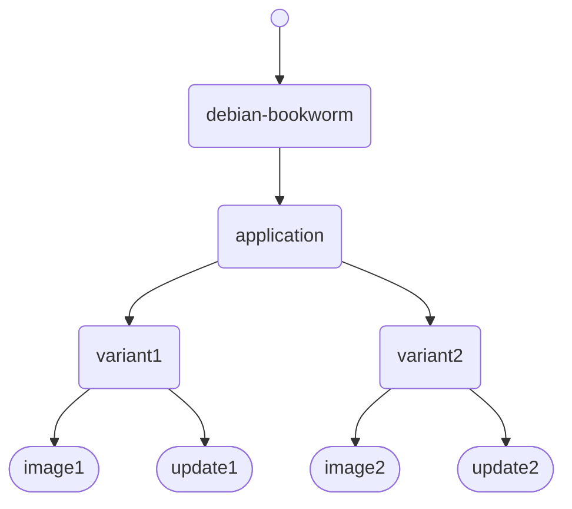

# Rugix Bakery

_Rugix Bakery_ is a flexible, user-friendly build system for bespoke Linux distributions.
It enables you to build customized variants of binary distributions, such as [Debian](https://debian.org/) and [Alpine Linux](https://alpinelinux.org/), or to build distributions entirely from source, leveraging industry standards like the [Yocto Project](https://www.yoctoproject.org/).
While inherently flexible and not tied to any specific distribution, Rugix Bakery ships with ready-to-use integrations for Debian, Alpine Linux, Raspberry Pi OS, and the Yocto Project's Poky reference distribution.[^rugix-yocto]

[^rugix-yocto]: You can run Yocto builds within Rugix Bakery.
In that case, the entire Yocto build for a given device will typically take place in a device-specific Rugix Bakery root layer.
Currently, **this integration is primarily intended as a proof of concept** for integrating a more traditional approach into Rugix Bakery.
If everything happens inside Yocto and you do not intend to apply any customizations or derive different variants from the same Yocto build, Rugix Bakery does not add much over a pure Yocto setup.
At the bare minimum, Rugix Bakery gives you an isolated build environment in terms of the Rugix Bakery Docker image and you may be able to use the other features of Rugix Bakery, e.g., its [integration testing framework](integration-testing.md).

Typically, Rugix Bakery is used to build _full system images_ and Rugix Ctrl _update bundles_ for OTA system updates.
System images generally contain a complete Linux root filesystem, a Linux kernel, and other, additional files required for booting a system.
For [supported devices](./devices/index.mdx), Rugix Bakery can build bootable images that are ready to be flashed onto a device out of the box.

Rugix Bakery allows you to define multiple _systems_ in a single _project_.
You can share build configurations between systems and build different _build artifacts_, such as system images, update bundles, individual filesystems, documentation, and a _software bill of materials_ (SBOM) for each system.
The ability to declare multiple systems is particularly useful when building your application for different device variants, also including images for testing in VMs, while sharing a common base.


## Build Process: High-Level Introduction

Before we get into further details, let’s first look at Rugix Bakery’s build process from a high-level perspective.

The build process revolves around two key concepts: _layers_ and _recipes_.
A _layer_ consists of the _build outputs_ of a specific stage of the build process.
Typically, a layer provides a root filesystem and a kernel for a system.
Layers can be built on top of each other, thereby reusing and extending an existing root filesystem as well as any other build outputs that are part of the previous layer.
In that regard, layers are akin to image layers in Docker.[^yocto-layers] A _recipe_ describes additions and modifications to be made to a layer.
A layer is then built by applying the recipes specified in the layer's build configuration, optionally using a _parent layer_ as a base.

[^yocto-layers]: If you are coming from Yocto, Rugix Bakery layers are distinct from Yocto layers in that they contain actual _build outputs_ while Yocto layers add or modify _build metadata and configurations_ used by the build system.


Here is a summary of the core concepts of the build process:

- _Build Outputs_: Files generated during the build process, including intermediate files used by subsequent stages of the build process.
- _Build Artifacts_: Build outputs of particular importance that should be extracted and stored, such as system images.
- _Build Configuration_: A declarative description of the build process and the desired artifacts.
- _Layer_: A collection of build outputs generated by a specific stage of the build process.
- _Recipe_: A reusable, modular description of how to create or modify build outputs.

Rugix Bakery implements a build process that generates build artifacts from layers created by executing recipes.

**Example: Two Device Variants.**
Assume you have an application that you want to integrate into a Debian-based system and then deploy to two different device variants.
In Rugix Bakery, you would define a layer for your application building upon a Debian parent layer.
The device-specific modifications will then be realized by a layer per device variant using the application layer as a parent.
Finally Rugix Bakery will generate a full system image for initial provisioning and a Rugix Ctrl update bundle for each variant, respectively.
The figure below shows the corresponding build tree with the final build artifacts at the bottom.

<p>

</p>

You can use the same process to build different software variants with a shared base as well.
The individual layers will be cached during the build process saving on build time and ensuring that all layers are based on identical parent layers.

**Building from Source.**
While Rugix Bakery can be used to build applications from source as part of the build process, its primary use case is to assemble pre-built components into a full system.
It is completely fine to use Rugix Bakery as a final phase of a larger build pipeline, building binaries and other parts of your application with external tools and then injecting them into a Rugix Bakery build.
That being said, you can write recipes and build your entire application from source to image with Rugix Bakery.


## Setup and Installation

Rugix Bakery is distributed as a Docker image (for `arm64` and `amd64`), ensuring a reproducible build environment that includes all the required tools and libraries.
Running Rugix Bakery outside of Docker is currently not supported.
Hence, to run Rugix Bakery, a working [Docker](https://www.docker.com/) or [Podman](https://podman.io/) installation is required.
On MacOS, please make sure to use the [MacOS virtualization framework and VirtioFS](https://docs.docker.com/desktop/settings/mac/#general), which is the default with recent versions of Docker Desktop.
For Windows, please use [WSL](https://learn.microsoft.com/en-us/windows/wsl/about).

Rugix Bakery ships as a small shell script named `run-bakery`.
The script runs an ephemeral Docker container with Rugix Bakery and sets everything up as required.
To start a fresh project, create an empty directory and then run:

```shell
curl -O https://raw.githubusercontent.com/silitics/rugix/v0.8/bakery/run-bakery && chmod +x ./run-bakery
```

This command will download the `run-bakery` shell script from Rugix's GitHub repository and make it executable.
You can then run Rugix Bakery with `./run-bakery`.
If you run `./run-bakery help` you will get usage instructions.

If you use a version control system to manage the project, we recommend committing the `run-bakery` shell script into the repository, so that everyone can run it without any additional setup (assuming they have Docker).

The shell script will also pin your project to a specific major version of Rugix Bakery thereby preventing breaking changes from breaking your build.
By setting the `RUGIX_BAKERY_IMAGE` environment variable you can also pin Rugix Bakery to a specific Docker image.
This adds an additional layer of protection against breaking changes and of security should the Rugix Bakery repository be compromised.
For production setups, it is therefore recommended to always pin Rugix Bakery to a specific Docker image.

Rugix Bakery currently requires the container to run in privileged mode such that `chroot` and bind mounts are available within the container.
These are required to run tools inside an environment that looks like the final system.
In the future, we plan to leverage Linux user namespaces to isolate the build and the system from the host without requiring elevated privileges.[^privileges]

[^privileges]: Existing tools use different approaches to set up an environment that looks like the final system without requiring privileges.
For instance, Yocto uses a tool called [Pseudo](https://git.yoctoproject.org/pseudo/about/) (an alternative to the better-known tool [Fakeroot](https://manpages.debian.org/bookworm/pseudo/fakeroot.1.en.html)), to intercept calls to system APIs via `LD_PRELOAD` and thereby fake a root environment.
This approach has limitations, for instance, it does not work with statically-linked binaries and also does not allow starting services binding sockets to ports below 1024.
Rugix Bakery strives to provide a container-like environment by using Linux namespaces and process isolation which does not suffer from the same limitations as existing approaches and thereby mimics a real system more closely.

## System Architectures

Rugix Bakery supports the following CPU architectures:[^architecture-plans]

[^architecture-plans]: We plan to support more architectures in the future.
Feel free to [open an issue on GitHub](https://github.com/silitics/rugpi/issues/new).

| Architecture | Description | Alpine | Debian | Raspberry Pi OS |
| ------------ | ----------- | ------ | ------ | --------------- |
| `amd64` | 64-bit x86 | `x86_64` | `amd64` | – |
| `arm64` | 64-bit ARMv8 | `aarch64` | `arm64` | `arm64` |
| `armv7` | 32-bit ARMv7 | `armv7` | `armhf` | – |
| `armhf` | 32-bit ARMv6 (Hard-Float) | `armhf` | – | `armhf` |
| `arm` | 32-bit ARMv6 | – | `armel` | – |

Note that different distributions have different and sometimes inconsistent names for different CPU families.
For instance, what Debian calls `armhf` is called `armv7` for Alpine Linux and not the same as `armhf` for Raspberry Pi OS.


## Comparison to Other Solutions

We believe that Rugix Bakery is unique in that it aims to provide a development experience for embedded Linux systems similar to what you will find with modern software development tooling, like [Cargo](https://doc.rust-lang.org/cargo/) (Rust) or [Uv](https://docs.astral.sh/uv/) (Python).
In particular, this means two things:

1. Provide a **single entrypoint to manage your project as well as to build, run, and test your system** and its variations.
2. Provide **built-in support for easy sharing** of build configurations (recipes and layers) within the community.

We are not aware of any existing tool that provides a seamless and unified experience in the way Rugix Bakery does.
While the developer experience is at the core of what we are doing with Rugix Bakery, it is only a means to an end.
By providing developers with an excellent development experience for embedded Linux devices, we strive to **enable better results at a lower cost**.

That being said, we still want to provide a rough comparison to existing solutions.
Generally, solutions in that space fall into one of two categories:
Either they build everything from source or they rely on binary distributions, like Debian.

### Build the World Solutions

:::info
If you don't think building everything from source yourself is a good idea for your use case, then [just skip ahead](#customizing-binary-distributions).
:::

<!-- spell:words Xdist, Compulab, Lüschner -->

Traditionally, build systems for embedded Linux systems build everything from source.
Popular open-source solutions in that category are [Yocto](https://www.yoctoproject.org/), [Buildroot](https://buildroot.org/), and [PTXdist](https://www.ptxdist.org/).
Building everything from source is necessary, if your device is not supported by binary distributions, e.g., because it requires specific patches to support niche hardware.
If that is the case, there is no way around one of the established solutions listed above.
However, with the proliferation of commodity embedded hardware, in particular the Raspberry Pi, over the last decade, more and more devices come with Debian support out of the box, including industrial-grade equipment from renowned brands.
For instance, [Moxa](https://www.moxa.com), [Compulab](https://www.compulab.com/), [Variscite](https://www.variscite.com/), and [Siemens](https://www.siemens.com/) all sell industrial-grade hardware with Debian preloaded.[^industrial-debian]
They do that for a very good reason: Building upon a well-established, proven binary distribution allows you to tap into the stability, familiarity, and the maintenance effort that goes into it.
Rugix Bakery has been developed to serve those use cases where it is not necessary to build everything from source.
While you can also run one of these established solutions within Rugix Bakery, essentially using it as a meta build system, **Rugix Bakery cannot and does not aim to replace or compete with these solutions** in any way.

[^industrial-debian]: This list is based on an [excellent blog post](https://www.get-edi.io/Debian-for-Embedded-Systems/) by [Matthias Lüschner](https://github.com/lueschem).

Even in cases where it is not strictly necessary to build everything from source because there is support for binary distributions, doing so anyway can have significant advantages that may justify the complexity that comes with it.
By building everything from source for a specific device, you gain fine-grained control over compilation options, you can easily apply custom patches, and, most importantly, **you get binaries and a system that can be specifically optimized for the device, including exactly and only the functionality that you require**.
If this is what you need, you know who you are and there is no point in convincing you to stop using any of these existing solutions, they are simply the right tool for the job.
That being said, there are also quite a few myths out there when it comes to the advantages of building everything from source which we would like to debunk in the following.
At this point, shout out to [Matthias Lüschner](https://github.com/lueschem) and his [excellent blog post _Debian for Embedded Systems – Seriously?_](https://www.get-edi.io/Debian-for-Embedded-Systems/) from which we took inspiration.

Often, reproducibility and license compliance are cited as reasons for using Yocto over Debian, however, (1) not only can [most Debian packages be built 100% reproducibly](https://tests.reproducible-builds.org/debian/reproducible.html) but [Debian snapshots](https://snapshot.debian.org/) dating back to 2005 also provide a way to build Debian-based systems fully reproducibly, and (2) all Debian packages come with license information that can be used to generate an SBOM and ensure compliance.
Rugix Bakery has built-in support for building systems based on Debian snapshots and we are working towards a 100% reproducible pipeline for building images and other artifacts.[^rugix-reproducibility]
The lack of reproducibility is not an inherent limitation of using Debian (or other binary distributions) for embedded systems, but, if anything, a lack of proper build tooling, which we rectify with Rugix Bakery.
The same holds true for license compliance.
Interestingly, similar issues also arise for container-based architectures, where you want container images to be reproducible and need to comply with the licenses of the included software.
We aim to exploit tools and techniques developed in that context for the use with embedded devices, all integrated in a modern build tool.

[^rugix-reproducibility]: We are almost there. Layers can already built reproducibly on Debian snapshots. The only thing missing is a good integration into the overall build system and support for also building images reproducibly. We plan to borrow ideas from modern package managers, generating a _lockfile_ from a build that can be used to reproduce it.

If you only need to adapt the compile-time options of a specific piece of software or apply patches to it, this is also possible with a binary distribution, especially with Debian, as is building a custom Linux kernel, e.g., with real-time patches or support for niche hardware.
The exact sources for all Debian packages are available and can be used to build custom variants of these packages.
So, if you just need to fine tune compile-time options for some packages, you can still get away with a binary distribution.

To summarize: Thanks to the proliferation of Debian support, especially in the industrial context, we believe that building everything from source is not necessary for the majority of use cases.
Furthermore, as argued above, by building upon Debian, you tap into the stability, familiarity, and the maintenance effort that goes into it.
In contrast, if you build everything from source, you buy into all the complexity that comes with it.
While **we would like to challenge the often-held preconception that building everything from source is _always_ the _only_ right way, we also recognize that there are clear use cases where it is and Rugix Bakery is not for those**.[^rugix-meta-build]

[^rugix-meta-build]: Except maybe as a meta build system, if you like.

### Customizing Binary Distributions

<!-- spell:words Debos, Mkosi -->

When it comes to the customization of binary distributions, the options are plentiful, ranging from bespoke collections of bash scripts to more structured solutions like [Debos](https://github.com/go-debos/debos), [Edi](https://www.get-edi.io), and [Mkosi](https://mkosi.systemd.io/).
While a bespoke collection of bash scripts may work, we think there is value in a more structured approach that addresses recurring challenges in the development and building of distributions for embedded devices once and can be reused across projects without the need to halfheartedly solve the same problems again and again.

Debos and Mkosi are general-purpose solutions for building simple images not tailored towards embedded systems.
If you just want a quick way to build a single image, you may want to give them a try.
In contrast, Rugix Bakery and Edi are much more feature rich with a specific focus on embedded systems and the challenges arising in that context.
For instance, Rugix Bakery can pull in recipes and layers from external repositories (similarly to a package manager) and its flexible layer system makes it straightforward to define multiple system variants with a shared base, e.g., for testing or to support different devices.
More importantly, however, **Rugix Bakery will build images with secure and reliable over-the-air update capabilities out of the box** that are directly bootable on supported devices.
Typically, if you are developing an embedded system today, robust over-the-air update capabilities are a must, not only to fulfill regularity requirements such as the Cyber Resiliency Act, but also to ship the latest features and improvements to your users.
Rugix Bakery also builds Rugix Ctrl _update bundles_ for shipping system updates to your devices.
As such, Rugix Bakery provides much more than a simple mechanism to build single system images, it is a comprehensive development tool for embedded projects.

Among the existing solutions, Edi (Embedded Development Infrastructure) clearly comes closest to what we aim for with Rugix Bakery.
However, while sharing the aim to simplify the development of embedded Linux systems, Edi's approach is very different from ours.
Edi bases its build workflow on [Ansible](https://ansible.com), a general-purpose automation tool, and uses the [Mender client](https://mender.io) for over-the-air updates, with the explicit aim to avoid “reinventing the wheel” as much as possible.
Instead of plugging together existing general-purpose tools, **we believe that a tailor-made development tool specifically designed for embedded systems could significantly reduce unnecessary friction and complexity in the development process**.
We also believe that the experience we aim for cannot be build within the confines of existing general-purpose tooling like Ansible.
This does not mean that we don't believe in reusing existing technologies, but if we can make the ride smoother by building a specific type of wheel designed for the bumpy road ahead, we will do it.
That being said, we think that Rugix Bakery leads to a much smoother development experience, especially when paired with Rugix Ctrl, than using Edi – but, that may very well be down to personal preference and familiarity with Ansible.
If you prefer hard technical facts instead, here you are:
While Rugix Bakery can spawn your system in a VM with a single command and even run automated integration tests on it, Edi can build containers, a feature which we currently lack.
Edi's reference support for over-the-air updates reuses the Mender client [which lacks certain features, like adaptive delta updates, that you may want and get with Rugix Ctrl](../ctrl/index.md#comparison-to-other-solutions) and its integration in Rugix Bakery.
Edi is also limited to Debian, while Rugix Bakery is independent of any specific distribution and also supports Alpine Linux and Raspberry Pi OS.
