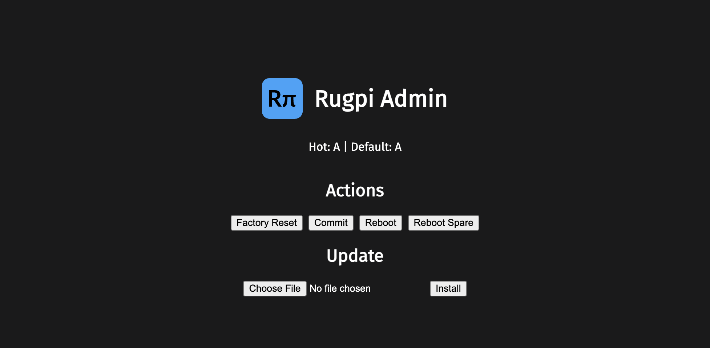

# Rugpi Admin

*Rugpi Admin* is a web-based admin interface for managing a Rugpi system.
In particular, it allows users to update a system simply by uploading an image and it offers direct access to state management features.

Screenshot:

