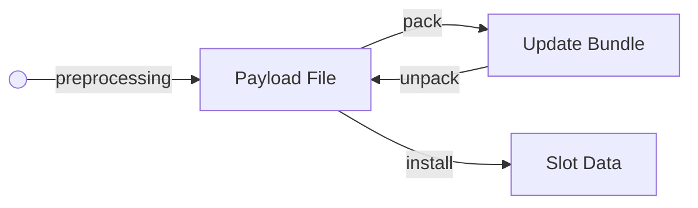

import JSONSchemaViewer from "@theme/JSONSchemaViewer";
import ReactMarkdown from "react-markdown";

import ConfigSchema from "@site/schemas/rugix-bundle-manifest.schema.json";


# Update Bundles

Updates are delivered to devices in the form of _update bundles_.

Rugix update bundles are based on a format specifically engineered for **efficient and secure** over-the-air updates.
The format provides **build-in support for cryptographic integrity checks, compression, and adaptive delta updates**.


## Introduction

An update bundle is a single file that may contain multiple update _payloads_.
Typically, for each payload, the update bundle specifies a slot (see [System Configuration: Slots and Boot Groups](./system-configuration.mdx#slots-and-boot-groups)) to which the payload should be installed.

Before we continue, let's define a few terms:

- *Slot Data*: Data that will exist in a slot after a successful update.
- *Payload File*: Single file corresponding to a payload in an update bundle.
- *Payload Data*: Actual data of a payload stored in an update bundle.

For instance, if a slot corresponds to a block device, then the slot data *and* payload file may be a filesystem image.
However, if a slot corresponds to a directory, then the slot data is the contents of this directory and the payload file may be a Tar archive of the directory's contents.
Now, the payload data is derived from the payload file.
For instance, the payload file may be compressed before being stored in an update bundle.
While the payload file must be reconstructible from the update bundle alone, e.g., by decompressing the payload data stored in the bundle, the slot data may or may not be reconstructible from the bundle alone.

These considerations give rise to the following transformations:



The data that should end up in the slot after an update is first _preprocessed_ to obtain a payload file, e.g., by creating a Tar archive from a directory.
This payload file is then _packed_ into an update bundle.
When the update bundle is installed, the payload file is _unpacked_ and then _installed_ to the slot specified in the update bundle, e.g., by extracting the formerly created Tar archive.

Note that Rugix Ctrl implements streaming updates, i.e., the unpacking step will not reconstruct the entire payload file but instead stream it to the installation step in pieces as the update bundle is read, e.g., over the network.

### Update Types

Update bundles can be built for two _types_ of updates:

- `full`: For full system updates involving a boot flow.
- `incremental`: For incremental updates not involving a boot flow.

For full system updates, a boot group must be provided to `rugix-ctrl` as a installation target (if there are more than two boot groups).
For incremental system updates, a boot group can be provided but it does not have to be.


## Bundle Creation

To work with bundles, you can use Rugix Bundler (`rugix-bundler`).
You can download pre-built binaries from [the Releases page of Rugix's Git repository](https://github.com/silitics/rugix/releases/).
If you are using Rugix Bakery, you can also use `./run-bakery bundler`.

Rugix Bundler offers a subcommand for creating a bundle from a _bundle directory_:

```shell
rugix-bundler bundle <bundle directory> <bundle path.rugixb>
```

A bundle directory is a directory with the following structure:

- `rugix-bundle.toml`: Rugix bundle manifest.
- `payloads/`: Directory containing the payload files.

:::tip
Rugix Bakery will generate bundles with good default settings so you do not have to care about the details.
:::

Here is an example of a bundle manifest:

```toml
#:schema https://raw.githubusercontent.com/silitics/rugix/refs/tags/v0.8.0/schemas/rugix-bundle-manifest.schema.json

update-type = "full"

hash-algorithm = "sha512-256"

[[payloads]]
filename = "boot.vfat"
[payloads.delivery]
type = "slot"
slot = "boot"
[payloads.block-encoding]
hash-algorithm = "sha512-256"
chunker = "casync-64"
compression = { type = "xz", level = 9 }
deduplication = true

[[payloads]]
filename = "system.ext4"
[payloads.delivery]
type = "slot"
slot = "system"
[payloads.block-encoding]
hash-algorithm = "sha512-256"
chunker = "casync-64"
compression = { type = "xz", level = 9 }
deduplication = true
```

The bundle contains two payloads, a filesystem for a boot partition (`boot` slot) and a filesystem for a system partition (`system` slot).

The `hash-algorithm` property specifies a hash algorithm for ensuring a bundle's integrity.
By default, an update bundle will include hashes of the payloads as well as other integral parts of the bundle using the specified algorithm.
When installing an update bundle, you can use `--verify-bundle <hash>` where `<hash>` is a hash of the bundle's header that can be obtained with:

```shell
rugix-bundler hash <bundle path.rugixb>
```

Note that this is not a hash over the entire bundle but just the bundle's header.
The header of the bundle, in turn, contains hashes of the payload headers as well as of the payloads themselves.
Combined these hashes form a [Merkle tree](https://en.wikipedia.org/wiki/Merkle_tree).
That way, by providing the hash of the root, Rugix Ctrl can verify different parts of the bundle individually as they are read.


## Payload Delivery

A payload can have two types of _delivery mechanisms_:

- `type = "slot"`: Payload is installed to a slot.
- `type = "execute"`: Payload is delivered by executing a command receiving the payload file via stdin.

For instance, to run a bash script you can use the following configuration:

```toml
[[payloads]]
filename = "update-script.sh"
[payloads.delivery]
type = "execute"
handler = ["/bin/bash", "-"]
[payloads.block-encoding]
hash-algorithm = "sha512-256"
chunker = "fixed-64"
```

:::danger
**Always add a block index/block encoding, otherwise untrusted data may be fed into the command.**[^untrusted-input]
:::

[^untrusted-input]: In the future, we will add a configuration option to Rugix Ctrl to prevent updates without block indices from being installed.

The `execute` delivery mechanism is extremely flexible and can be used to deliver all kinds of updates to a device.


## Delta Updates

Rugix Ctrl supports adaptive delta updates out-of-the-box and can also be configured towards static delta updates.

### Adaptive Delta Updates

Adaptive delta updates work with any HTTP server supporting range queries, making them particularly easy to implement.
For adaptive delta updates, the payload file is split into multiple blocks (see [Block Encoding](#block-encoding)).
The bundle then contains an index of the blocks of the payload file that can be used to fetch only the blocks that do not already exist locally on a device.

Adaptive delta updates have the following advantages:

- Easy to implement, only an HTTP server supporting range queries is required.
- Only a single update bundle is required to update from any version.
- A block index may be required anyway (see security considerations below).

Adaptive delta updates require matching block indices in the bundle and on the device (see [Over-the-Air Updates](../over-the-air-updates.mdx)).

### Static Delta Updates

In addition to adaptive delta updates, you can also implement static delta updates, where you create a bundle to specifically go from one version to another.
This allows the use of efficient delta compression algorithms typically leading to very small update sizes.
Static delta updates are realized as part of the preprocessing and installation step using off-the-shelf tools like [Xdelta](https://en.wikipedia.org/wiki/Xdelta).
Compared to adaptive delta updates, static delta updates typically require much less data to be transferred.
Therefore, they are ideal when the bandwidth to a device is severely limited or traffic is at a premium.
You can realize static delta updates right now with custom update slots.
If you need help, Silitics, [the company behind Rugix](/commercial-support) has you covered.
We may add native support in the future.

:::warning
Even with static delta updates you likely want a block index (with a large fixed block size) to ensure the integrity of blocks before feeding them through the delta compression tool for security reasons (see below).
:::


## Block Encoding

The example given above specifies a _block encoding_ for each payload.
A block encoding will add a _block index_ for the respective payload to the bundle.
To this end, the payload file will first be divided into blocks.
In the examples above, we use the same algorithm as [Casync](https://github.com/systemd/casync) to divide the payload file.
The block index is then a sequence of the hashes of these blocks:

```
Payload File        Block Index

Block 0             Hash 0
Block 1             Hash 1
Block 2             Hash 2

   •                  •
   •                  •
   •                  •

Block N             Hash N
```

The block encoding has three main purposes:

1. Cryptographic verification of individual blocks.
2. Deduplication of blocks that occur multiple times in a payload file.
3. Adaptive delta updates.

**Cryptographic Verification.**
When unpacking the payload, the block index is used to verify the integrity of each block individually, thereby establishing trust in their contents before they are installed/written anywhere.
This enables streaming updates while never writing any untrusted data anywhere.
Furthermore, it becomes impossible to exploit security vulnerabilities in tools processing the bundle file as part of the installation stage, as no untrusted input is fed to the installation stage.

**Block Deduplication.** 
Normally, we would write the payload file directly into the bundle.
However, if we have a block index and block deduplication is enabled, then we only write blocks which we have not previously written, i.e., we use the block index to skip duplicate blocks of the payload file.
When later reading the payload data from the bundle, we use the block index to restore the original payload file by reading any blocks that we already saw earlier from the slot where the payload is written to.

Note that block deduplication requires two assumptions:
First, the payload file must be written directly to the slot without any postprocessing.
Second, we need random access on the slot.
For these reasons, block deduplication is only compatible with `block` and `file` slots.
If you try to install a payload with block deduplication to a `custom` slot, the update will abort.

**Adaptive Delta Updates.**
We use the block index to adaptively only fetch those blocks of the payload data that we do not already have locally on the device.
This requires the ability to efficiently skip over blocks in the payload data, that we do already have.
Rugix Ctrl implements efficient skipping with HTTP range queries.
This technique is also used by [RAUC](https://rauc.io/) and can significantly reduce the required data transfer to those parts of the update which have actually changed.
The process may then roughly look as follows:

```
╭────────────────╮
│ Payload Header │ ─────────────────────┐
│                │                      ▼
│                │             ╔══════════════════╗                     ╭──────╮
│  Payload Data  │ ◀─────────▶ ║ Adaptive Fetcher ║ ──────────────────▶ │ Slot │
╰────────────────╯  read/skip  ╚══════════════════╝        write        ╰──────╯
                                        ▲            (read/write/seek)
                                        │ read/seek
                                        ▼
                                ╭───────────────╮
                                │ Local Storage │
                                ╰───────────────╯
```

Note that this is orthogonal to block deduplication.

**Variable Block Sizes.**
Blocks may have a variable or fixed size.
In case of variable block sizes, e.g., when using a rolling hash to divide the payload file (as done by [Casync](https://github.com/systemd/casync)), the update bundle also contains a _size index_.

**Block Compression.**
To reduce the size of the update bundle while still enabling adaptive delta updates and block-wise cryptographic verification of updates, blocks can be compressed individually.
In that case, we always need a size index, as fixed size blocks may compress to different sizes.
If block compression is enabled, then the size index stores the sizes of compressed blocks while the hash index contains the hashes of the uncompressed block.
This allows skipping blocks that we already have.
If blocks are variable size, then the true block size of unknown blocks becomes known only after decompression.


## Configuration Reference

For reference, here is the complete schema for bundle manifest files:

<JSONSchemaViewer schema={ConfigSchema} viewerOptions={{
    DescriptionComponent: ({description}) => <ReactMarkdown children={description} />
}}/>

You will find the most recent version of this schema [on GitHub](https://github.com/silitics/rugix/blob/main/schemas/rugix-bundle-manifest.schema.json).